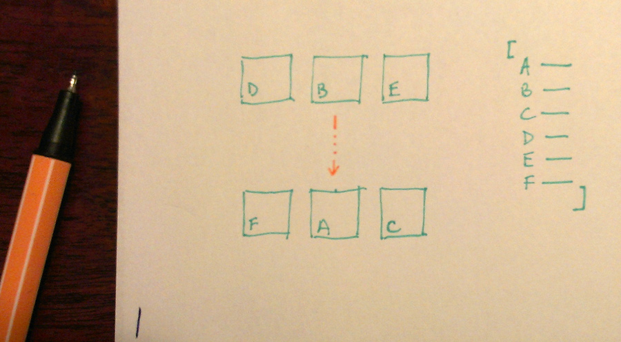

jquery-randomcells.js
===========
jQuery plugin that will display a limited list of elements (for example images) with random order and after a given period it will swap it's elements randomly.  
To avoid duplicates the given source element list should be at least twice as long as the displayed list number (max)  
by [Roman Kühl](http://www.kuhl.pl).  

Example
---
Check out the basic [example](http://kuhl.pl/github/randomcells/)  
and the [carousel example](http://kuhl.pl/github/randomcells/carousel.html)  
HTML:    
```html
<script src="jquery.js" type="text/javascript"></script>  
<script src="jquery-randomcells.js" type="text/javascript"></script>
<ul id="rc-data" style="display: none;">
	<li>A</li>
	<li>B</li>
	<li>C</li>
	<li>D</li>
	<li>E</li>
	<li>F</li>
</ul>
<ul id="rc-list"></ul>
```  
JS:  
```javascript
$(document).ready(function() {
	$("#rc-list").randomCells();
});
```
Options
---
```max``` how many elements are visible at once  
```delay``` time delay (ms)  
```selector``` elements selector
```src``` source elements selector
```mode``` 'spread' or 'swap' mode  
```swapMode``` 'random' or 'ordered' (for swap mode only)  
```cloneClass``` class added to item's inner clone (only with overlap)  
```clonedOrygin``` class added to item's inner orygin (only with overlap)  
```overlap``` new item overlaps old one (carousel)  
```hideClass``` class name added on hide animation  
```hideTime``` hide delay (animation) time (ms)  
```showTime``` show delay (animation) time (ms)  
```showClass``` class name added on show animation  
```visibleClass``` class name added when element is added to the visible list  
```dev``` if true some messages are logged into the console  

JS:  
```javascript
$(document).ready(function() {
	$("#rc-list").randomCells({
		'max'			: 3,
		'delay'			: 1000,
		'selector'		: 'li',
		'src'			: '#rc-data',
		'mode'			: 'swap',
		'swapMode'		: 'ordered',
		'hideTime'		: 200,
		'hideClass'		: 'rc-hide',
		'showTime'		: 200,
		'showClass'		: 'rc-show',
		'visibleClass'	: 'rc-active',
		'dev'			: false
	});
});

